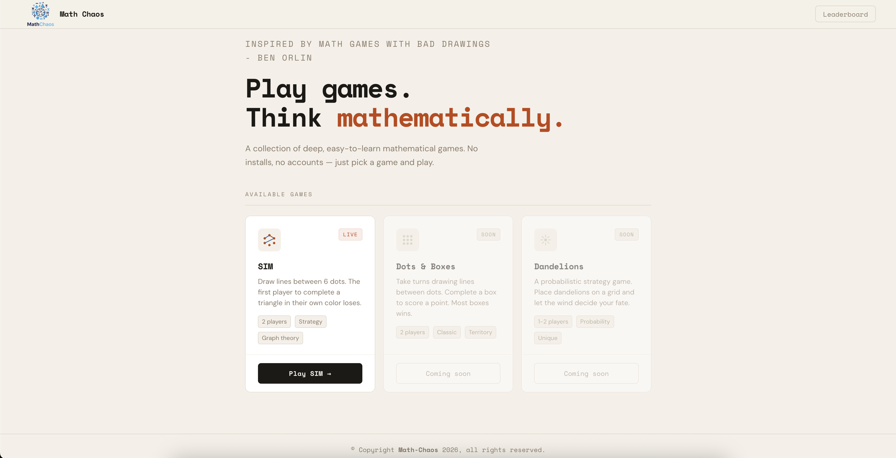
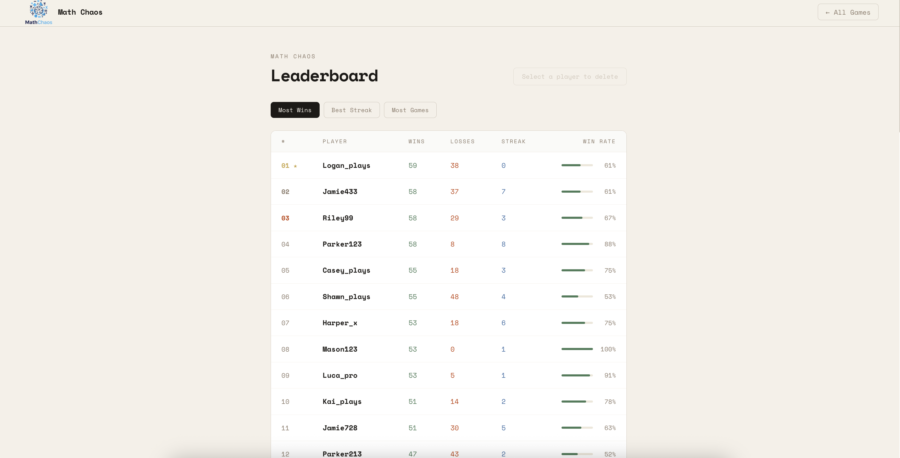
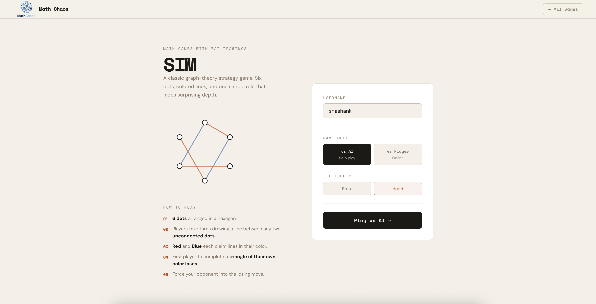
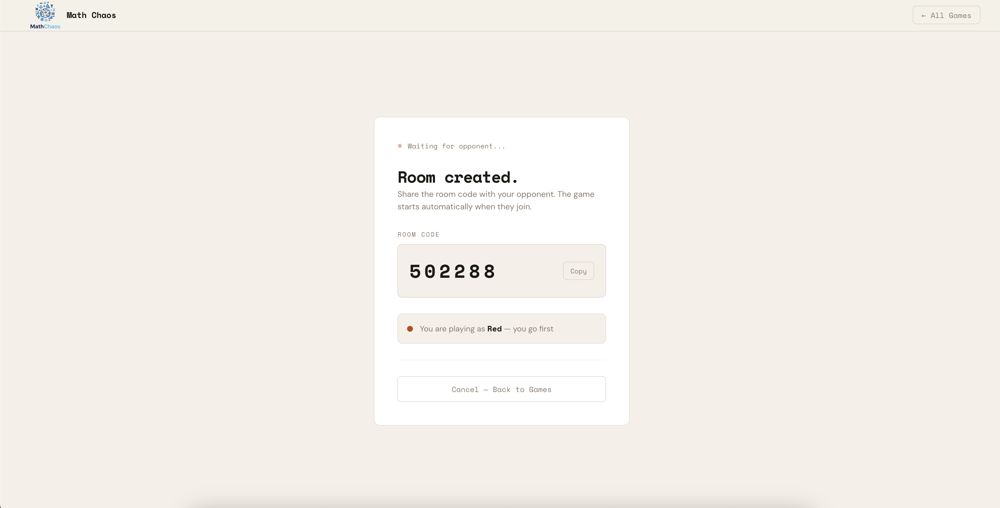
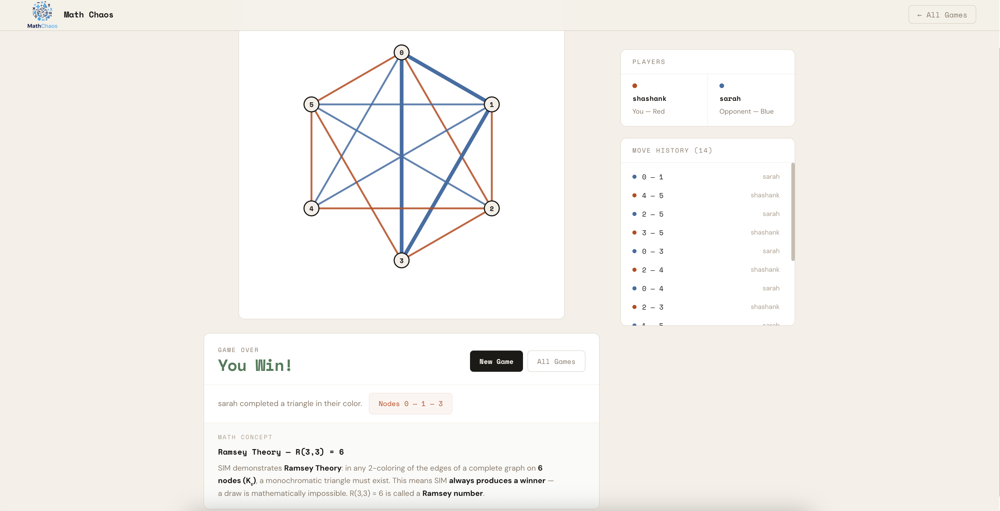

# Math-Chaos: Play games. Think mathematically.

## Author & Class Info

- **Authors:** [Shashank More](https://shashankmore20.github.io/) & [Sarah Gillespie](https://sarahgillespie.github.io/sarah-gillespie-homepage/)
- **Class:** CS5610 Web Development — Northeastern University
- **Deployed:** [math-chaos-frontend.onrender.com](https://math-chaos-frontend.onrender.com)
- **GitHub:** [github.com/SarahGillespie/Math-Chaos](https://github.com/SarahGillespie/Math-Chaos)
- **Slides:** [Google Slides](https://docs.google.com/presentation/d/1Txg7esqugnr_ZlTYldNrhnMeOg1Ip8IKLnQMLOIpSKs/edit?usp=sharing)
- **Video Demonstration:** 

---
## Project Objective
**Description:**
I found my favorite game book (Math Games with Bad Drawings) at [MIT Press](https://mitpress.mit.edu) in Kendall Square. This book introduces 75 math-based puzzle games that are intended to be played with pencil, paper, and dice. Our favorite is “SIM” which is a Ramsey theory (basically a mix of economics and probability theory named after Frank Ramsey) game where two players attempt play a multi-color connect-the-dots on the same hexagon shape while trying to force their opponent to make a triangle shape while defensively avoiding that outcome for themself.

**User Stories/Personas:**
Addy: As a user, I want a quick and addictive game to play while commuting without the mess of dice and paper colored pencils. I want to be able to play with a bot and have unlimited time between turns.
Bijesh and Cassandra: As a user, I want to play a game with a non-local friend without needing to download a whole video game and want to keep track of game count and scores over time. I want a 30 second time limit between turns.
Danielle: As a user, I want to learn game theory / math concepts by actively applying those concepts in a way that reading a textbook would not.


## Screenshots

## Screenshots

| View | Screenshot |
| ---- | ---------- |
| Home |  |
| Leaderboard |  |
| SIM Game |  |
| Game Lobby |  |
| Finish |  |


## Instructions to Build / Run

### Prerequisites
- [Node.js](https://nodejs.org/) (v18+)
- A [MongoDB Atlas](https://www.mongodb.com/atlas) account and connection string

### 1. Clone the Repository
```bash
git clone https://github.com/your-username/Math-Chaos.git
cd Math-Chaos
```

### 2. Configure Environment Variables
Create a `.env` file inside the `backend/` folder:
```bash
nano backend/.env
```
Add the following:
```
MONGO_URI=mongodb+srv://<username>:<password>@cluster0.xxxxx.mongodb.net/mathchaos
PORT=5001
```
> Reminder: Never commit your `.env` file. Make sure it's listed in `.gitignore`.

### 3. Install Dependencies
Install packages for both the backend and frontend:
```bash
cd backend && npm install
cd ../frontend && npm install
```

### 4. Run the App
You'll need **two terminal tabs** running simultaneously.

**Terminal 1 — Backend:**
```bash
cd backend
npm run dev
```

**Terminal 2 — Frontend:**
```bash
cd frontend
npm run dev
```

### 5. Open in Browser
Once both servers are running, visit:
```
http://localhost:5173
```

## Tech Stack
**Frontend**
React (via Vite)

**Backend:**
Node.js + Express
WebSockets (ws library)

**Datebase:**
MongoDB (hosted on MongoDB Atlas)

## Rubric Checklist

| **Criteria** | **Status / Link** |
| --- | --- |
| Design Document (description, personas, stories, mockups) | [View Design Doc](./submissions/DesignDoc.pdf) |
| App accomplishes all approved requirements | ✔ SIM game with AI mode, multiplayer, leaderboard |
| App is usable and includes instructions | ✔ In-app rules on GameMenu + this README |
| App is actually useful | ✔ Mathematical strategy game demonstrating Ramsey Theory |
| ESLint config — no errors | ✔ `npm run lint` → 0 errors in both frontend and backend |
| Code properly organized | ✔ `backend/routes/`, `backend/controllers/`, `backend/utils/`, `frontend/src/components/`, `frontend/src/hooks/`, `frontend/src/utils/` |
| At least 3 React components using hooks | ✔ GameBoard, GameMenu, GameLobby, Leaderboard, Home (6 total) |
| Each React component in its own file | ✔ Each component in its own folder with matching CSS file |
| Deployed on public server | ✔ [math-chaos-frontend.onrender.com](https://math-chaos-frontend.onrender.com) |
| 2+ Mongo collections with CRUD | ✔ `games` (Shashank — full CRUD) + `players` (Sarah — full CRUD) |
| Database with 1,000+ records | ✔ `seed.js` generates 1,000 games + 50 players |
| Uses Node + Express | ✔ `backend/server.js` with Express + native `ws` WebSocket |
| Formatted with Prettier | ✔ `npm run format` applied to both frontend and backend |
| No non-standard tags for standard components | ✔ Proper `<button>`, `<input>`, `<nav>`, `<table>` throughout |
| CSS organized by components | ✔ Each component has its own `.css` file loaded in its `.jsx` file |
| Clear descriptive README | ✔ (this file) |
| No exposed credentials | ✔ `.env` gitignored, `.env.example` provided in both frontend and backend |
| package.json for backend and frontend | ✔ [backend/package.json](./backend/package.json) + [frontend/package.json](./frontend/package.json) |
| MIT License | ✔ [LICENSE](./LICENSE) |
| No leftover unused code | ✔ No default routes, no unused React favicon, no leftover files |
| Google Form submission correct | ✔ Thumbnail + links verified |
| Short narrated demo video | [Watch Here](https://drive.google.com/your-video-link) |
| Code frozen on time | ✔ 24 hours before class |
| Defines PropTypes for every React component | ✔ All components have PropTypes defined |
| No axios, Mongoose, CORS or prohibited libraries | ✔ Native fetch, MongoDB driver, manual CORS headers, native ws |

## API Endpoints

### Games
| Method | Path | Description |
|--------|------|-------------|
| `POST` | `/api/games` | Create a new game |
| `GET` | `/api/games` | Get all games |
| `GET` | `/api/games/:id` | Get a game by ID |
| `PATCH` | `/api/games/:id/move` | Add a move to a game |
| `PATCH` | `/api/games/:id/status` | Update game status |
| `DELETE` | `/api/games/:id` | Delete a game |

### Players
| Method | Path | Description |
|--------|------|-------------|
| `POST` | `/api/players` | Create a new player |
| `GET` | `/api/players` | Get all players |
| `GET` | `/api/players/:username` | Get a player by username |
| `PATCH` | `/api/players/:username/result` | Update a player's result |
| `PATCH` | `/api/players/:username` | Update a player |
| `DELETE` | `/api/players/:username` | Delete a player |

### Health
| Method | Path | Description |
|--------|------|-------------|
| `GET` | `/api/health` | Check server status |


## GenAI Usage

- **Model:** Claude Sonnet 4.6 (Anthropic): March 2026


---

## Contributing

Pull requests are welcome. Follow the standard GitHub process and the authors will review at their earliest convenience.

---

## License

[MIT License](./LICENSE) — Copyright (c) 2026 Shashank More and Sarah Gillespie
